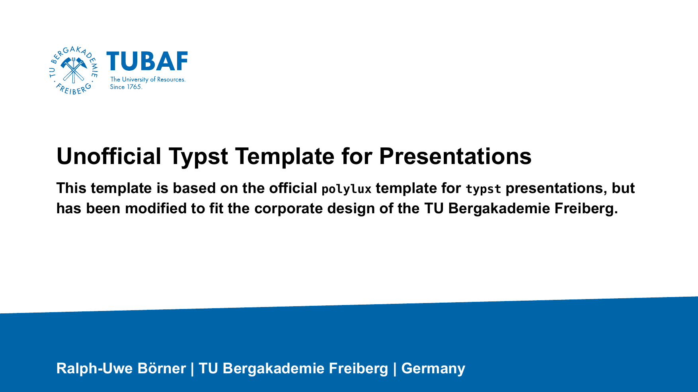
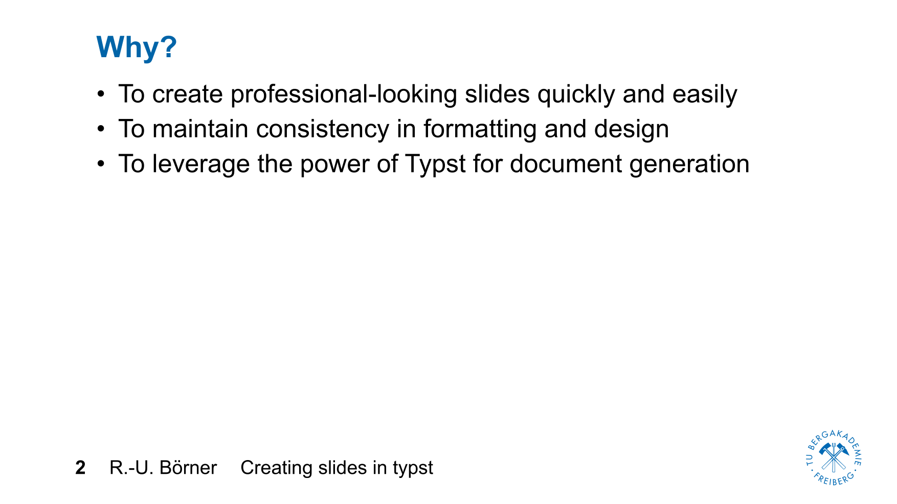

# Unofficial TUBAF `typst` presentation theme

A Polylux theme for Typst that follows the corporate design of the TU Bergakademie Freiberg.

Designed for
- lectures
- student seminars
- conference talks
- thesis defences





## Features

- follows the TU Bergakademie Freiberg corporate design
- built on Polylux
- lightweight and easy to customise
- native Typst syntax
- code highlighting
- mathematical typesetting
- automatic slide numbering
- PDF output

## Dependencies

You can get sources and pre-built binaries for the latest release of Typst from the [releases page](https://github.com/typst/typst/releases). 

## Installation

```shell
git clone https://github.com/ruboerner/typst-tubaf-polylux 
```

## Quick start

Once you have installed `typst`, create a file, e.g., `slides.typ` with the following content: 

```typst
#import "@preview/polylux:0.4.0": *
#import "tubaf-theme.typ": *

#set page(paper: "presentation-16-9")
#set text(size: 24pt, font: "Arial")

#show: tubaf-theme.with(
  title: "My Presentation",
  author: "Jane Doe",
  institute: "TU Bergakademie Freiberg",
)

#slide(title: [Introduction])[

Hello World.
]

```
You can compile a PDF using

```shell
typst compile slides.typ
```
 
## Recommended Editor

The best authoring experience is provided by **Visual Studio Code**
together with the **Tinymist** extension. It offers live preview,
syntax highlighting, autocompletion, diagnostics, and forward search,
making it the recommended environment for developing Typst
presentations.


## Philosophy

This template intentionally keeps the visual design simple.
It aims to reproduce the official appearance of TU Bergakademie Freiberg while taking advantage of `typst`'s modern typesetting capabilities.
The focus is on readable scientific presentations rather than decorative slide design.


## Acknowledgements

Built upon the excellent Polylux presentation framework.

## License

This packages is under a Creative Commons License.